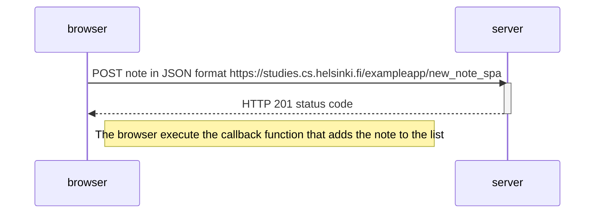

```mermaid
sequenceDiagram
  participant browser
  participant server

  browser->>server: POST note in JSON format https://studies.cs.helsinki.fi/exampleapp/new_note_spa
  activate server
  server-->>browser: HTTP 201 status code
  deactivate server
  Note right of browser: The browser execute the callback function that adds the note to the list
```
